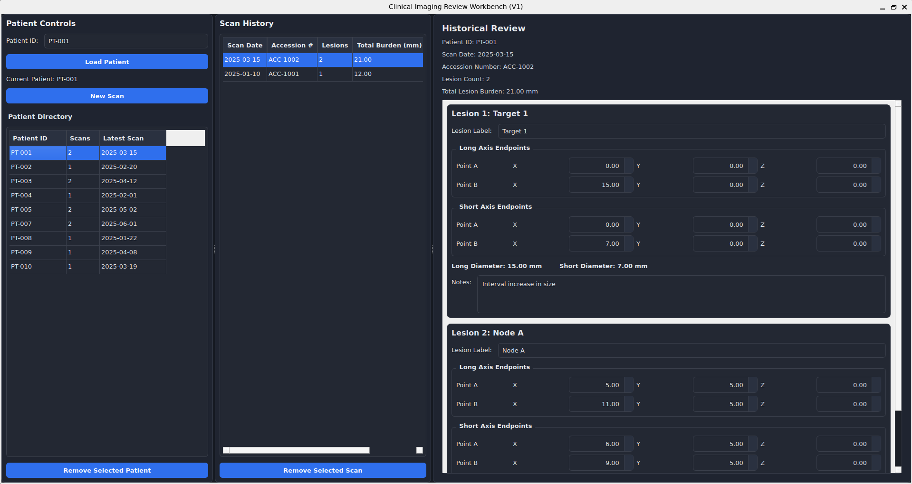

# Clinical Imaging Review Workbench

A desktop application for structured longitudinal lesion annotation across serial imaging studies.

This project simulates a radiology-style workflow for tracking lesions over time using RECIST-inspired measurements. Users can browse patients, create new scan entries, add multiple lesions per scan, review historical scan data in read-only mode, and manage records through a desktop GUI.

Built as a portfolio project to demonstrate modern Python desktop application development, data modeling, validation logic, and healthcare-adjacent workflow design.

---

## Screenshot



---

## Features

- **Patient Directory**
  - View all patients in a table
  - See number of scans and latest scan date
  - Load a patient by selecting from the directory or entering a Patient ID

- **Scan History**
  - Review all scans for the selected patient
  - See scan date, accession / study ID, lesion count, and total burden

- **Structured Lesion Entry**
  - Create a new scan with multiple lesions
  - Record:
    - lesion label
    - long-axis endpoints `(x1, y1, z1) → (x2, y2, z2)`
    - short-axis endpoints `(x1, y1, z1) → (x2, y2, z2)`
    - computed long diameter
    - computed short diameter
    - free-text notes

- **Historical Review**
  - Past scans are displayed in read-only mode after save
  - Supports longitudinal comparison across serial studies

- **Record Management**
  - Remove selected scan
  - Remove selected patient

- **Demo Data**
  - On first launch, the app auto-loads sample data if the database is empty
  - Makes the project immediately usable for demos / portfolio review

---

## Tech Stack

- **Python 3.11+**
- **PySide6** (desktop GUI)
- **SQLite** (local persistence)
- **JSON** (demo data seeding)

---

## Project Structure

```text
clinical-imaging-review-workbench/
├── app/
│   ├── database.py
│   ├── models.py
│   ├── seed_data.py
│   ├── services.py
│   ├── utils.py
│   └── ui/
│       ├── lesion_form.py
│       ├── main_window.py
│       └── scan_detail.py
├── docs/
│   └── screenshots/
│       └── clinical-imaging-review-workbench_screenshot.png
├── sample_data/
│   └── demo_data.json
├── main.py
├── requirements.txt
└── README.md

Getting Started
1) Clone or download the repository

If you are using Git:

git clone https://github.com/vdeeplearning/clinical-imaging-review-workbench.git
cd clinical-imaging-review-workbench

Or download the ZIP from GitHub and extract it, then open a terminal in the project folder.

2) Create a virtual environment
Windows (PowerShell)
python -m venv .venv
macOS / Linux / WSL
python3 -m venv .venv
3) Activate the virtual environment
Windows (PowerShell)
.venv\Scripts\Activate.ps1

If PowerShell blocks activation, run:

Set-ExecutionPolicy -Scope Process -ExecutionPolicy Bypass
.venv\Scripts\Activate.ps1
macOS / Linux / WSL
source .venv/bin/activate
4) Install dependencies
pip install -r requirements.txt
5) Run the application
python main.py
First Launch / Demo Data

On first launch:

the app creates a local SQLite database file
if the database is empty, it automatically seeds demo data from:
sample_data/demo_data.json

This means the app should open with a populated Patient Directory, making it immediately usable for demo purposes.

Resetting Demo Data

To reset the app to a fresh demo state:

Close the app
Delete the local database file:
clinical_imaging_review.db
Run the app again:
python main.py

The app will recreate the database and re-seed from the demo JSON.

Validation Notes

Current validation includes:

lesion label required
long-axis endpoints cannot be identical
short-axis endpoints cannot be identical
warning for duplicate lesion labels
warning if short diameter exceeds long diameter
Architecture Overview
UI (PySide6)
  ├── Patient Directory / Controls
  ├── Scan History
  └── Scan Workspace (new entry or read-only detail)

Services Layer
  ├── create / load patient
  ├── save scan
  ├── load scan history
  ├── load scan detail
  ├── delete scan
  └── delete patient

Data Layer (SQLite)
  ├── patients
  ├── scans
  └── lesions
Data Model
Patient
  └── many Scans
        └── many Lesions